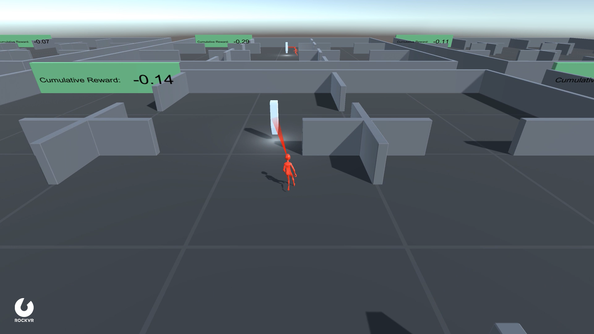

## Find Flag

- Set-up: Environment where the agent needs to figure out how to find the flag in a minimum amount of time.
- Goal: Find the flag (destination) in a minimum amount of time.
- Agents: The environment contains one agent.
- Agent Reward Function (independent):
  - +2 For finding the flag.
  - -0.0002 at each step.
- Behavior Parameters:
  - Vector Observation space: 54 variables corresponding to 
    - 52 ray-casts each detecting one of two possible objects (flag & walls)
    - 2 variables to capture x & z velocity of an agent
  - Vector Action space (Continuous): Size of 2 correspondings to agents rotation and forward/backward movement.
  - Visual Observations (Optional): None
- Float Properties: None
- Benchmark Mean Reward: 1.84
